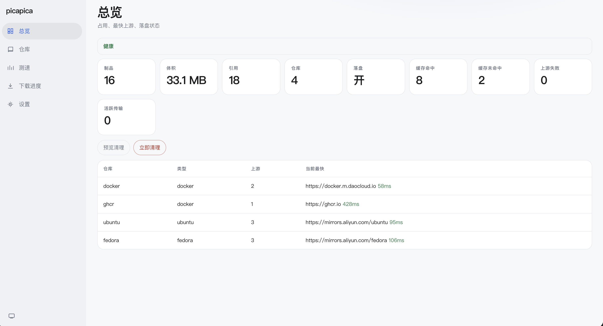

# picapica

[中文](README.zh.md)

Pull-through software source for Docker / Ubuntu / Fedora. Clients hit this process; a miss fetches and stores, a hit is served locally.



## Run

```bash
git clone https://github.com/rayz2099/picapica.git
cd picapica
mkdir -p config
cp config.example.yaml config/config.yaml
docker compose up -d
```

When upgrading an existing Compose deployment, run `mkdir -p config && mv config.yaml config/config.yaml` before recreating the container. New images include a health check and Compose uses `unless-stopped` restart policy.

Open http://127.0.0.1:8080/ — token `picapica`. Change `api_keys` before exposing the port.

## Clients

**Docker** (on the Docker host):

```bash
cat > /etc/docker/daemon.json <<'EOF'
{
  "insecure-registries": ["127.0.0.1:8080"],
  "registry-mirrors": ["http://127.0.0.1:8080"]
}
EOF
docker pull 127.0.0.1:8080/docker/library/busybox
```

**apt**

```bash
cat > /etc/apt/sources.list.d/ubuntu.list <<'EOF'
deb http://127.0.0.1:8080/ubuntu jammy main
EOF
apt-get update
```

**dnf**

```bash
cat > /etc/yum.repos.d/fedora.repo <<'EOF'
[fedora]
name=fedora
baseurl=http://127.0.0.1:8080/fedora/releases/$releasever/Everything/$basearch/os/
enabled=1
gpgcheck=0
EOF
dnf makecache
```

The Repos page → Tutorial copies the same scripts for the running instance.

## Config

The config file is the source of truth (Compose uses `config/config.yaml`; the standalone binary defaults to `config.yaml`). Repositories, egress, and tokens are hot-reloaded; changes to `listen`, `data_dir`, or `probe_interval` require a restart. The Web UI Settings tab edits the same document as JSON. SQLite stores refs and stats; blobs are content-addressed.

| Field | Meaning |
| --- | --- |
| `listen` | HTTP bind; restart required after changes |
| `data_dir` | Blobs + SQLite; restart required after changes |
| `proxy_url` | HTTP / HTTPS / SOCKS5 egress used by `proxy: default` |
| `probe_interval` | Probe period such as `30s`, `10m`, or `1h`; restart required |
| `cache` | `true` stores artifacts; `false` only forwards |
| `cache_max_bytes` | Optional capacity; prune evicts unreferenced, expired, then least-recently-used artifacts |
| `cache_ttl` | Optional cache TTL using the same duration syntax |
| `public_url` | Optional external URL for Web UI examples and Docker Host aliases |
| `api_keys` | Control-plane Bearer tokens; at least one |
| `repos[].name` / `type` | URL prefix `/{name}/...`; type is `docker`, `ubuntu`, or `fedora` |
| `repos[].aliases` | Optional Host/path aliases for the same repository |
| `repos[].username/password` | Optional upstream basic authentication |
| `repos[].upstreams[].url` | HTTP(S) source URL |
| `repos[].upstreams[].proxy` | `direct`, `default`, `none`, or an upstream-specific proxy URL |

Data plane is anonymous. Control plane needs a token.

## Operations

Local commands read the bind address and first token from `--config`. Remote management requires an explicit URL and token. Management requests have a 30-second total timeout by default; change it with `--timeout`.

```bash
picapica health
picapica status
picapica transfers --limit 100
picapica probe run
picapica probe results
picapica config validate config.yaml
picapica config show
picapica config apply config.yaml
picapica cache ls [query]
picapica cache tree <repo> [prefix] --page 1 --per-page 50
picapica cache rm <repo> <namespace>
picapica cache prefix rm <repo> <prefix>
picapica cache prune --dry-run
picapica cache prune

picapica --url https://pica.example.com --token '<token>' status
```

The Web UI overview shows health, cache hits/misses, upstream failures, and active transfers, and can preview or execute prune. `health` is unauthenticated for orchestrator probes; other control-plane commands require a token.

## Binary

[Releases](https://github.com/rayz2099/picapica/releases) cover linux / macOS / Windows (amd64, arm64). Linux is musl-static. Each release includes `SHA256SUMS`; compare its entry with `sha256sum <archive>`. Artifact signing is intentionally not provided because this project does not introduce an external signing key. Only the last 3 versions are kept.

```bash
./picapica serve --config config.yaml
```

Or `docker pull ghcr.io/rayz2099/picapica:latest`.

From source: `just compile` / `just serve` / `just check` (Rust required).

## License

[Apache License 2.0](LICENSE) © 2026 rayz2099
